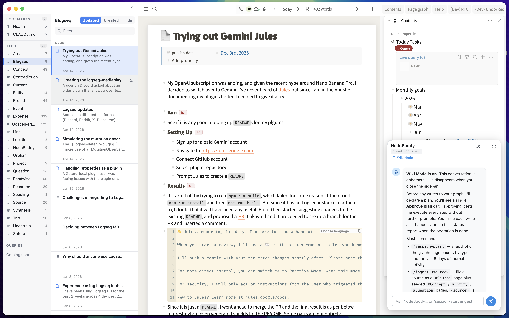

# logseq-navigator-plugin

  

> A three-pane note navigator that replaces the underused native left sidebar in Logseq DB graphs. Browse your graph by **Bookmarks**, **Tags**, and **Page References** — with date-grouped results, pinning, filtering, and previews.

---

## ✨ Features

- **Three folder sources in a single rail:**
  - **Bookmarks** — pin any page or block via the right-click menu and jump back to it in one click.
  - **Tags** — every user-defined tag in your graph is auto-enumerated, with live node counts. Click a tag to list everything tagged with it.
  - **Page References** — define your own watchlist of pages; clicking one lists every page and block that links to it (journal references included).
- **A serious node list:** results are grouped by date (Today / Yesterday / Previous 7 days / Previous 30 days / Older), sortable by **Updated**, **Created**, or **Title**, filterable as you type, and virtualised so large folders stay fast.
- **Per-folder pinning:** pin nodes to the top of any folder; pins persist across sessions.
- **Lazy previews:** block previews hydrate only for the rows on screen.
- **Live refresh:** folders and counts update automatically (debounced) as your graph changes.
- **Theming + resizable panes:** follows Logseq's light/dark mode; drag the rail edge or the inner divider to resize — widths persist.
- **Per-graph persistence:** bookmarks, page references, pins, and widths are stored as a JSON `#Code` block on a config page inside the graph itself — no external files, and the config travels with your graph sync.
- **`Mod+K` passthrough:** the familiar search shortcut works from inside the navigator and opens Logseq's search.

### How folders are populated

The navigator never asks an LLM or guesses — every folder resolves deterministically through the Logseq plugin API.

- **Tags** are enumerated from the graph's tag entities (built-in `logseq.*` classes are excluded) and resolved via `getTagObjects`.
- **Page References** resolve through `getPageLinkedReferences`, so the list matches what the Linked References section on the page itself would show — including references made from journal pages.
- **Counts** shown next to Tags and Page References are computed from the same resolution path as the listing, so the badge always matches what you'll see when you click.

### Requirements

- **Logseq DB graphs only.** The plugin checks `checkCurrentIsDbGraph()` on load and stays inactive on file-based graphs.

## 📸 Screenshots / Demo

## ⚙️ Installation

1. Open Logseq.
2. Go to the **Marketplace** (Plugins > Marketplace).
3. Search for **logseq-navigator**.
4. Click **Install**.

## 🛠 Usage

### Opening the plugin

- Command palette (`Mod+Shift+P`) → `Navigator: Toggle`, or
- Keyboard shortcut: `Mod+Shift+L`.

The navigator opens as a left rail with two panes: folders on the left, nodes on the right. Drag the divider between them to resize the folder pane, or drag the rail's right edge to resize the whole navigator. Use the arrow button (top right) to close it; enable **Open by default** in settings to have it open with Logseq.

### Bookmarks

- Right-click any **block** → `Navigator: Add as Bookmark`.
- Open a **page**'s menu (`⋯`) → `Navigator: Add as Bookmark`.
- Click a bookmark to navigate to it; click `×` to remove it.

### Tags

Tags are listed automatically — there is nothing to configure. Each row shows the number of nodes carrying that tag. Click a tag to list its pages and blocks in the node pane.

### Page References

- Open a **page**'s menu (`⋯`) → `Navigator: Add as Page Reference`.
- The page appears in the **Page References** section with a count of its linked references.
- Click it to list every page and block referencing it (journal references included).
- Hover a row to reveal the `×` button and remove it from the list. Removing the entry never touches the page itself.

### The node pane

- **Sort** with the Updated / Created / Title buttons; date grouping adapts to the chosen sort.
- **Filter** with the search box to narrow the list by title.
- **Pin** a node with its pin button to keep it in a `Pinned` group at the top of that folder.
- **Click** a node to navigate to it in the main window.
- **Shift+Click** a node (or **Shift+Enter** when it's focused) to open it in Logseq's right sidebar instead, keeping the main window where it is.

### The config page

All navigator state (bookmarks, page references, pins, pane widths) is stored as a JSON code block on a page in your graph — `Navigator/Config` by default, configurable in settings. You can read it, sync it, and back it up like any other page. Avoid hand-editing it while Logseq is open; the plugin rewrites it on every change.

### Settings

`Logseq Settings > Plugin Settings > logseq-navigator-plugin`:

- **Open by default** — open the navigator automatically when Logseq starts (default on).
- **Config page name** — the page that stores the navigator's JSON config block (default `Navigator/Config`).
- **Refresh debounce (ms)** — how long to wait after a database change before refreshing the active folder (default `400`).

## ☕️ Support

If you enjoy this plugin, please consider supporting the development.

  &nbsp;

## 🤝 Contributing

Issues are welcome. If you find a bug, please open an issue. Pull requests are not accepted at the moment as I am not able to commit to reviewing them in a timely fashion.
